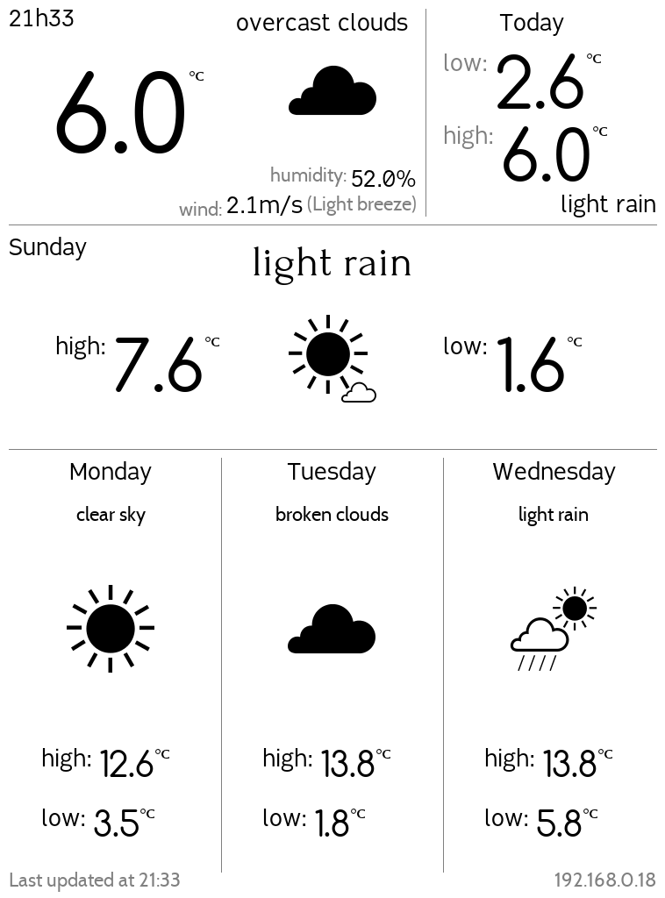

# yawk: Yet Another Weather app for Kobo

Based on [Kevin Short's app](https://www.mobileread.com/forums/showthread.php?t=194376)

Running on Python's distribution from [NiLuJe](https://www.mobileread.com/forums/showthread.php?t=254214)

Using the excellent library [FBInk from NiLuJe](https://github.com/NiLuJe/py-fbink)

Uses [Open Weather Maps](https://openweathermap.org/) as forecast and current conditions provider

Everything was tested on a [Kobo Glo (N613)](https://en.wikipedia.org/wiki/Kobo_Glo) using the firmware 4.15.12920 (python3.9.1 on kobo-stuff-1.6.N-r18009)

Everything was tested on a [Kobo Touch (kobo3/N905)](https://en.wikipedia.org/wiki/Kobo_eReader_Touch) using the firmware 4.20.14622 (python2.7 on kobo-stuff-1.5.N-r16911) 

# Disclaimer

The procedure I'm suggesting here will most likely void the warranty.

Follow the guidelines at your own risk, I'm not responsible for any problems that might arise from this app's usage.

# Installation 

1. I suggest you Reset your device to factory defaults:
	1. Turn it off
	1. Holding the Light Switch, slide the power button for ~1 sec
	1. Hold the Light switch until the "Restoring" screen appears
	1. Follow directions on the screen (you'll need the [Kobo Setup app](https://www.kobosetup.com) and an account, I used from RakutenKobo itself)
	1. Update everything, connect to your WiFi network
1. Provide [telnet access](https://wiki.mobileread.com/wiki/Kobo_WiFi_Hacking#Enabling_Telnet_.26_FTP) - you can skip this step if you're able to find out the IP address of the device using some other method.
	1. Check the file .kobo/ip.txt for the IP address
1. Install [NiLuJe's Stuff](https://www.mobileread.com/forums/showthread.php?t=254214) - tested with Version 1.6.N @ r18009 on 2021-Jan-22
	1. Download the pre built stuff
	1. Extract contents to a folder
	1. Connect the Kobo using the USB cable and copy the KoboRoot.tgz to the /.kobo/ folder
	1. Remove the device and let it do its thing (it should reboot)
1. Using the preferred FTP client (ie: [WinSCP](https://winscp.net/eng/download.php)), copy the repository's content to the folder /mnt/onboard/.apps/yawk
1. Create an account in [Open Weather Maps](https://openweathermap.org/):
    1. Take note of your API key
    1. Find out the ID your city (use the website to check the weather in your city, copy the ID from the URL)
1. Open a SSH (or telnet) connection (user: root, password blank):
	1. Install Python 3
		```tmux new -s kobo update-kobostuff Python```
	1. Navigate to /mnt/onboard/.apps/yawk/ and run install.sh
		1. if it says "-sh ./install.sh: not found", you have to convert the line endings to unix style:
		```sed -i 's/^M$//' install.sh```
		1. Answer the questions correctly

# Screenshot


    

# Doubts, suggestions

brunolalb@gmail.com
